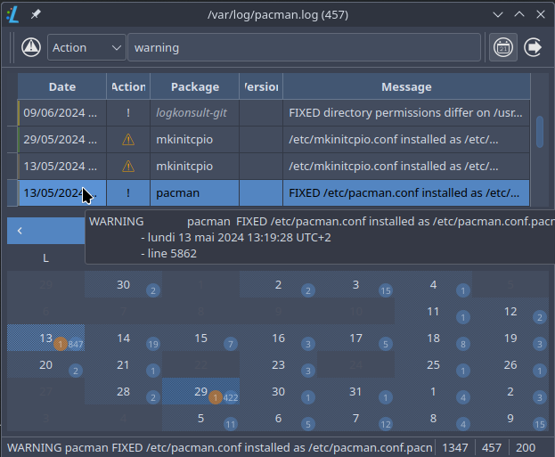

# logkonsult

Qt6 gui for read pacman logs



## Configuration

We can use a file `~/.config/logkonsult.conf`

```
editor = "zeditor"  # log editor
diff = "code"       # diff conf/pacnews
days = 60           # load last x days
```

If we want edit/save config file/pacnew, install `meld` with `gvfs` for admin:// protocol

```
pacman -S meld gvfs --asdeps
```

if `logkonsult.conf` not exists, logconsult use first tool find in system.

